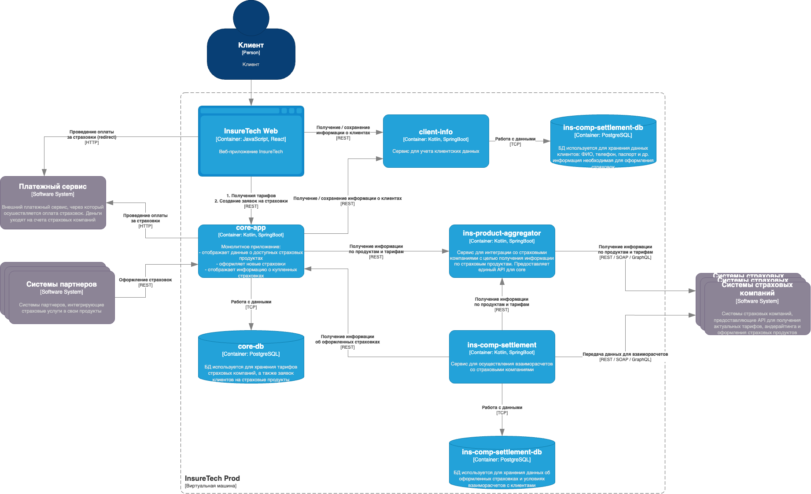
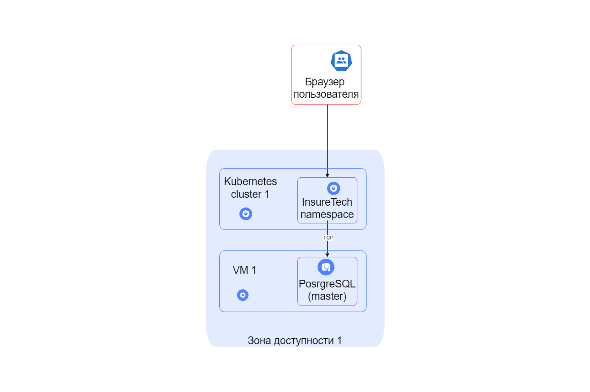

# Сдача проектной работы 8 спринта

На этот раз вы выступите в роли архитектора ПО для InsureTech. Компания предоставляет агрегационные услуги в сфере страхования. Она работает с частными и корпоративными клиентами:

- частным клиентам компания предлагает удобный сайт для подбора и оформления страховок,
- корпоративным клиентам и партнёрам предоставляет API для интеграции страховых услуг в их продукты.

Сейчас основной продукт InsureTech — это страхование жизни.

## Проблемы компании

Компания успешно запустила MVP своего приложения и планирует активно развиваться дальше. Всё бы хорошо, но приложение столкнулось со всеми классическими проблемами быстрого роста:

1. **Сайт медленно загружает страницы.** Когда нагрузка на приложение повышается, пользователи массово жалуются на то, что страницы грузятся по несколько минут или не загружаются вообще. При этом максимально зафиксированная нагрузка на запросы поиска составила 50 RPS, а на запросы оформления — 10 RPS. Такое положение дел плохо влияет на показатели NPS и retention.
2. **Нарушается SLA для B2B-клиентов.** Менеджеры уже неоднократно получали сообщения от партнёров, что SLA API не соответствует заявленному. В ходе изучения таких инцидентов выяснилось, что в эти периоды количество запросов от одного из партнёров кратно возрастало. Оно достигало суммарно 250 RPS на все вызываемые операции. По сути, один из партнёров «сжирал» все ресурсы приложения. С этим партнёром изначально договорились, что нагрузка не будет превышать 20 RPS.
3. **Приложение падает.** InsureTech несколько раз столкнулась с проблемой недоступности приложения. Команда реагировала на проблему очень медленно, поскольку узнавала о ней от пользователей. Каждый час простоя сервис несёт финансовые убытки — примерно 500 тысяч рублей. Также бизнес несёт репутационные потери: в СМИ выходят негативные публикации, у сервиса низкие показатели удовлетворённости пользователей, а некоторые партнёры уже заявили о нежелании продлевать сотрудничество.

InureTech планирует в ближайшее время провести большую рекламную кампанию. Ожидается существенный прирост пользователей.

Вам как архитектору нужно проработать описанные проблемы и предложить для них решения. В текущем состоянии приложение является «узким горлышком» для развития бизнеса.

## Архитектура приложения

Основные компоненты приложения:

- **core-app** — монолитное бэкенд-приложение. Оно отвечает за отображение доступных клиенту продуктов, оформление заявок на новые страховки и отображение уже оформленных.
- **client-info** — сервис управления клиентскими данными. Он передаёт данные core-app для оформления страховок. Если пользователя нет в базе данных или его данные изменились, в процессе оформления страховки сервис client-info вносит данные в базу. Он же отвечает за отображение и редактирование клиентских данных в личном кабинете.
- **ins-product-aggregator** — сервис интеграции со страховыми компаниями для получения информации о продуктах. Ещё он запрашивает у разных партнёров предложения по ОСАГО для конкретного автомобиля. Сервис предоставляет единый API, агрегируя данные от всех страховых компаний.
- **ins-comp-settlement** — сервис взаиморасчётов со страховыми компаниями. Раз в месяц он отправляет перечень оформленных страховок в страховые компании для расчёта выплаты агентских премий.
- Веб-приложение для клиентов сервиса.

Для деплоя всех приложений используется кластер Kubernetes, расположенный в одной зоне доступности.

В качестве базы данных используется PostgreSQL. Каждый сервис, использующий БД, имеет отдельную схему данных. БД развёрнута на отдельной ВМ в единственном экземпляре.

Взаимодействие между фронтендом и бэкендом происходит посредством REST.
API предоставляет партнёрам доступ напрямую через LoadBalancer Kubernetes, который доступен в сети Интернет.

Бэкенд-приложение интегрировано с пятью страховыми компаниями.

Вот диаграмма контейнеров приложения в модели C4:



# Как подготовиться к работе

Первым делом — приготовьтесь к работе над проектом.

Настройте draw.io:

1. Установите draw.io или откройте онлайн-редактор. Используйте тот способ, который вам удобнее.
2. В draw.io установите библиотеки иконок Yandex Cloud для сервисов и контейнеров.

Установите инструменты, которые нужны для выполнения заданий:

1. [Minikube](https://kubernetes.io/ru/docs/tasks/tools/install-minikube/).
2. [Kubectl](https://kubernetes.io/ru/docs/tasks/tools/install-kubectl/).
3. [Python](https://www.python.org/downloads/).
4. Pip
5. [Locast](https://locust.io/). Чтобы его установить, потребуется pip.

Подготовьте репозиторий, куда вы будете загружать решения заданий:

1. Проект этого спринта вы будете сдавать в Git-репозитории. Создайте публичный репозиторий в GitHub или GitLab. Назовите его «architecture-insuretech».
2. Проект состоит из шести заданий. Решение каждого задания нужно будет залить в отдельную директорию. Создайте в репозитории шесть директорий и назовите их «Task1», «Task2», «Task3», «Task4», «Task5» и «Task6».
3. Чтобы ревьюеру было проще проверять вашу работу, а вам отслеживать изменения на разных итерациях, загрузите файлы в свой репозиторий и сделайте пулл-реквест. На ревью нужно отправить ссылку на пулл-реквест.

Повторите теорию, которая точно пригодится:

1. Как документировать решения с помощью модели C4. Мы рассказывали про это в спринте «Создание микросервисов, построение пайплайна CI/CD», тема называется «Построение микросервисного лендскейпа».
2. Синтаксис манифестов Kubernetes.
3. Синтаксис конфигураций Nginx.
4. Синтаксис OpenAPI (Swagger).
5. Синтаксис схем GraphQL.

Когда всё будет готово, можете смело приступать к заданиям!

# Задание 1. Проектирование технологической архитектуры

Компания хочет сделать упор на развитие в регионах РФ. Планируется значительный рост количества пользователей и запросов. Нужно обеспечить бесперебойную работу сервиса 24/7, при этом сервис должен обслуживать клиентов из всех часовых поясов.

Требования к отказоустойчивости системы крайне высокие: RTO — 45 мин., RPO — 15 мин. Согласно требованиям бизнеса, доступность приложения должна быть равна 99,9%.

Дополнительно к этому нужно обеспечить одинаковое время загрузки страниц для пользователей из разных регионов. Оно не должно зависеть от географического местоположения пользователя.

На текущий момент сервис хранит ограниченный набор данных, который включает в себя:

- базовую информацию о клиентах — ФИО, контакты, документы,
- информацию о продуктах и тарифах,
- историю заявок клиентов.

Общий объём данных, которые хранятся в системе, равен 50 GB.

## Что нужно сделать
Необходимо спроектировать технологическую архитектуру приложения так, чтобы оно отвечало требованиям бизнеса. Создайте схему итогового решения на основании текущей технологической архитектуры сервиса.

Вот [схема текущей архитектуры в draw.io](InsureTech_as-is.drawio)



Создайте новый документ в draw.io и назовите его «InureTech_технологическая архитектура_to-be». Работайте над первым заданием там.

Постарайтесь выдержать единый стиль оформления. Желательно, чтобы схема вашего решения была оформлена в той же нотации, что и схема текущей архитектуры. Для этого используйте библиотеки объектов Yandex Cloud. Ссылки на них мы дали в блоке «Как подготовиться к работе».

При проектировании уделите внимание следующим аспектам:

1. **Определите стратегию масштабирования и отказоустойчивости.** Рассмотрите вертикальное и горизонтальное масштабирование для вашей системы. Оцените, какая стратегия будет эффективнее. Требуется ли использование дополнительных зон безопасности?
2. Если приняли решение деплоить приложение в нескольких зонах безопасности, то продумайте и отразите на схеме следующие вопросы: 

    - **Проработайте конфигурацию развёртывания приложения в Kubernetes.** Вы будете использовать независимые кластеры в каждой площадке или один растянутый? Оставьте на схеме комментарий с объяснением, почему вы выбрали тот или другой подход.
    - **Спланируйте балансировку нагрузки.** Опишите подход к балансировке нагрузки, который обеспечит распределение трафика между вашими сервисами и географически распредёленными серверами. Явно отразите на схеме все health check.
    - **Определите наиболее подходящую фейловер-стратегию.** Она должна отвечать заданным требованиям отказоустойчивости. Отразите её на схеме на уровне взаимодействия клиента с приложением.
    - **Определите конфигурацию базы данных.** Учитывая требования RTO и RPO, спроектируйте конфигурацию базы данных: определите, как вы будете обеспечивать репликацию данных и их резервное копирование. Если будете использовать конкретный фреймворк конфигурации кластера БД, отразите его на схеме.

3. Определите, будете ли вы применять шардирование БД. Отразите своё решение на схеме.

Когда будете сдавать задание, загрузите готовую схему в директорию Task1 в рамках пул-реквеста.

# Задание 2. Динамическое масштабирование контейнеров

Сейчас сервисы InsureTech развёрнуты в Kubernetes. Каждый из них развёрнут в определённом количестве экземпляров.

Обычно этих экземпляров достаточно для успешной обработки всех запросов. Но в периоды пиковой нагрузки система не справляется: она демонстрирует нестабильное поведение и постоянно перезагружает поды из-за нехватки памяти. Как следствие, пользователи получают негативный опыт работы с приложением. Бизнес видит, что NPS снижается.

Можно, конечно, держать больше реплик постоянно активными, чтобы система могла справиться с пиковыми нагрузками. Но это экономически невыгодно и приведёт к низким показателям утилизации ресурсов. Таким образом, вам необходимо решить проблему с помощью конфигурации динамического масштабирования для сервисов компании.

Вы будете тестировать динамическое масштабирование на примере простого приложения. Оно предоставляет два ресурса:
- `GET /` — получение идентификатора пода;
- `GET /metrics` — получение метрик в формате Prometheus.

Метрика `http_requests_total` возвращает количество запросов для метода получения идентификатора пода.

[Образ тестового приложения](https://github.com/yandex-practicum/scaletestapp/pkgs/container/scaletestapp). Оба метода приложения доступны по порту `8080`.

## Что нужно сделать

1. Поднимите локальный кластер Kubernetes в Minikube.
2. Активируйте metrics-server.
3. Напишите манифест развёртывания (Deployment) Kubernetes для запуска тестового приложения. Для начального количества реплик установите значение, равное единице. Лимит памяти установите равный “30Mi”. Примените написанную конфигурацию в вашем кластере. В рамках пул-реквеста добавьте файл в директорию Task2.
4. Напишите и примените манифест сервиса (Service) для доступа к приложению, которое вы установили на прошлом шаге. В рамках пул-реквеста файл с этим манифестом тоже загрузите в директорию Task2.
5. Настройте динамическую маршрутизацию на основании показателей утилизации оперативной памяти с помощью Horizontal Pod Autoscaler (HPA). Для нашего тестового приложения оптимальный уровень утилизации памяти равен 80%. В качестве максимального количества реплик рекомендуем установить 10. Примените манифест в вашем кластере. В рамках пул-реквеста загрузите готовый манифест в директорию Task2.
    ```Bash
    minikube service <имя сервиса> --url
    ```
6. Настройте динамическую маршрутизацию на основании показателей утилизации оперативной памяти с помощью Horizontal Pod Autoscaler (HPA). Для этого нужно активировать поддержку метрик в вашем кластере. Самый простой способ это сделать — воспользоваться командой:
    ```Bash
    minikube addons enable metrics-server
    ```
7. Теперь создайте манифест для Horizontal Pod Autoscaler. Этот манифест будет автоматически масштабировать количество реплик вашего приложения в зависимости от роста потребления оперативной памяти (memory). Для нашего тестового приложения оптимальный уровень утилизации памяти равен 80%. В качестве максимального количества реплик рекомендуем установить 10. Примените манифест в вашем кластере. Загрузите готовый манифест в директорию Task2 в рамках пул-реквеста.
8. Теперь надо убедиться, что всё работает как задумано. Для этого необходимо сгенерировать нагрузку на приложение. Воспользуйтесь инструментом нагрузочного тестирования locust:
    - Создайте Locustfile. Это сценарий на Python, где вы определяете поведение пользователей. Создайте файл с именем locustfile.py в удобной для вас директории. Скопируйте туда код:
        ```Python
        from locust import HttpUser, between, task
    
        class WebsiteUser(HttpUser):
            wait_time = between(1, 5)
      
            @task
            def index(self):
                self.client.get("/") 
        ```
        Этот пример создаёт класс пользователя, который переходит на главную страницу (`"/"`) с интервалом между запросами от 1 до 5 секунд.

    - Откройте терминал и перейдите в директорию, где находится ваш locustfile.py. Выполните команду:
        ```Bash
        locust
        ```
    - После запуска Locust откройте веб-браузер и введите адрес http://localhost:8089. Вы увидите веб-интерфейс Locust, где можно настроить параметры теста: количество пользователей и hatch rate — скорость, с которой генерируются новые пользователи.

    - Запустите тест и проанализируйте результаты. Проще всего посмотреть результаты в дашборде Kubernetes. В локальном кластере Minikube его можно открыть с помощью команды:
        ```Bash
        minikube dashboard
        ```
        Сделайте скриншоты дашборда или выгрузите логи, которые покажут, что количество реплик базы данных поменялось в ответ на сгенерированную нагрузку. Загрузите их в директорию Task2 в рамках пул-реквеста.

# Задание 3. Переход на Event-Driven архитектуру

Сервисы core-app и ins-comp-settlement получают данные о доступных продуктах через REST API сервиса ins-product-aggregator. В момент вызова он:

- запрашивает информацию из всех страховых компаний (сейчас их пять),
- агрегирует её в единый список,
- возвращает этот список в рамках того же синхронного запроса.

Чтобы ускорить работу сервисов, при изначальном проектировании команда решила хранить локальные реплики данных о продуктах и тарифах в сервисах core-app и ins-comp-settlement.

Сервис core-app осуществляет запрос к ins-product-aggregator раз в 15 минут, а ins-comp-settlement — раз в сутки (ночью), при формировании реестра оформленных страховок. Иногда команда сталкивается с ошибками взаимодействия между этими сервисами. Они связаны с задержками ответов или ошибками при взаимодействии с API страховых компаний.

Дополнительно сервис ins-comp-settlement раз в сутки осуществляет запрос в core-app по REST API для получения всех оформленных за день страховок. Эти данные он использует. 

В ближайшее время InsureTech планирует подписать агентское соглашение ещё с пятью страховыми компаниями. Вам предстоит спроектировать решение, которое устранит текущие проблемы.

## Что нужно сделать

1. Проанализируйте текущую архитектуру. Создайте текстовый документ и напишите там список проблем и рисков, которые связаны с планируемым ростом нагрузки. Когда всё будет готово, загрузите документ в директорию Task3 в рамках пул-реквеста.
2. Обновите [диаграмму контейнеров InsureTech](InsureTech_C4_сontainer-diagram.drawio), предложив решения для выявленных вами рисков и проблем. При этом:
    - Не меняя декомпозицию функциональности между сервисами, подумайте, какие взаимодействия стоит переделать на Event-Streaming.
    - Решите, будете ли вы использовать паттерн Transactional Outbox.

Когда схема будет готова, загрузите её в директорию Task3 в рамках пул-реквеста.

# Задание 4. Проектирование продажи ОСАГО

Компания планирует вскоре запустить новый продукт: оформление ОСАГО онлайн. Пользовательский путь выглядит так: клиенту предлагается заполнить заявку с информацией о своём автомобиле, после этого сервис запрашивает у всех доступных страховых компаний предложения с условиями страхования под заявку клиента. Бизнесу важно, чтобы на экране пользователя предложения от каждой страховой компании отображались сразу, как только от неё пришёл ответ. Максимальное время ожидания решения от страховой компании — 60 секунд. 

Все страховые компании предоставляют однотипные REST API с двумя эндпоинтами:

- создать заявку на ОСАГО,
- получить предложение по заявке.

Бизнес предполагает, что в пик нагрузки количество одновременных пользователей, создающих заявку на ОСАГО, может достигать 2,5 тысячи человек.

Вы обсудили задачу с командой разработки и приняли такие решения:

1. Сохранить подход, который использовался для получения данных о продуктах и тарифах из страховых компаний.
2. Выделить отдельный сервис для взаимодействия со страховыми компаниями — **osago-aggregator**.

Функциональная обязанность этого сервиса — отправка заявок в страховые компании и дальнейший опрос решений по ним для передачи результатов в core-app. Остальная функциональность, связанная с оформлением ОСАГО, остаётся на стороне бэкенда в core-app.

Теперь вам нужно проработать ещё несколько моментов, исходя из требований бизнеса. Доработайте схему, которая у вас получилась в третьем задании. Отразите на ней ваши решения по этим вопросам:

1. Проработайте реализацию osago-aggregator. Решите:
2. Требуется ли ему своё хранилище данных?
3. Какой API он предоставляет core-app?
4. Определите средство интеграции между сервисами core-app и osago-aggregator.
5. Подумайте над API для веб-приложения в core-app.
6. Определите средство интеграции между веб-приложением и core-app. Если будете использовать средство, отличное от REST, отразите интеграцию новой стрелкой.
7. В зависимости от выбранных средств интеграции подумайте, требуется ли где-то применение паттернов отказоустойчивости:
    - Rate Limiting,
    - Circuit Breaker,
    - Retry,
    - Timeout.

    Отобразите применение паттернов на схеме с помощью обозначений из этой библиотеки.

8. Примите во внимание, что сервисы задеплоены в нескольких экземплярах. Подумайте, зависит ли ваше решение от этого.

Загрузите новый вариант схемы в директорию Task4 в рамках пул-реквеста.

# Задание 5. Проектирование GraphQL API

При развитии сервиса управления клиентскими данными (client-info) команда столкнулась с проблемой. Потребители данных (веб-приложения и сервиса core-app) в разных сценариях продажи и обслуживания страховок могут требовать абсолютно разные данные. При этом карточка клиента у сервиса достаточно объёмная: общий атрибутивный состав достигает 500 штук. Из-за высокой вариативности набора запрашиваемых данных команда приняла решение в своём REST API предоставить множество отдельных ресурсов, с помощью которых можно запрашивать отдельные объекты данных клиента: контакты, документы, родственники и так далее.

Однако такая реализация кратно увеличивает нагрузку и RPS сервиса client-info, поскольку в рамках одного сценария могут потребоваться сразу несколько объектов данных — их придётся запрашивать по отдельности. Предоставить один ресурс для получения абсолютно всех данных клиента не представляется возможным: объём передаваемых данных будет настолько большим, что замедлит скорость взаимодействия с сервисами (особенно с веб-приложением).

Вы обсудили проблему с командой и приняли решение перевести REST API сервиса client-info на GraphQL.

## Что нужно сделать

Спроектируйте GraphQL на основании существующего контракта сервиса:

1. Проанализируйте Swagger контракт client-inf. Оцените существующую структуру API, выделите ключевые ресурсы и операции.

    ### Контракт Swagger
    ```
    swagger: '2.0'
    info:
     description: API сервиса управления клиентскими данными
     version: 1.0.0
     title: Клиентский Сервис
    host: api.client-service.com
    basePath: /v1
    schemes:
     - https
    paths:
     /clients/{id}:
       get:
         tags:
           - Клиент
         summary: Получить информацию о клиенте по ID
         description: Возвращает информацию о клиенте.
         produces:
           - application/json
         parameters:
           - name: id
             in: path
             description: ID клиента
             required: true
             type: string
         responses:
           '200':
             description: Успешный ответ
             schema:
               $ref: '#/definitions/Client'
     /clients/{id}/documents:
       get:
         tags:
           - Документы
         summary: Список документов клиента
         description: Возвращает список документов клиента по ID.
         produces:
           - application/json
         parameters:
           - name: id
             in: path
             description: ID клиента для поиска его документов
             required: true
             type: string
         responses:
           '200':
             description: Успешный ответ
             schema:
               type: array
               items:
                 $ref: '#/definitions/Document'
     /clients/{id}/relatives:
       get:
         tags:
           - Родственники
         summary: Информация о родственниках клиента
         description: Возвращает информацию о родственниках клиента по ID.
         produces:
           - application/json
         parameters:
           - name: id
             in: path
             description: ID клиента
             required: true
             type: string
         responses:
           '200':
             description: Успешный ответ
             schema:
               type: array
               items:
                 $ref: '#/definitions/Relative'
    definitions:
     Client:
       type: object
       properties:
         id:
           type: string
         name:
           type: string
         age:
           type: integer
     Document:
       type: object
       properties:
         id:
           type: string
         type:
           type: string
         number:
           type: string
         issueDate:
           type: string
         expiryDate:
           type: string
     Relative:
       type: object
       properties:
         id:
           type: string
         relationType:
           type: string
         name:
           type: string
         age:
           type: integer
    ```
2. На основе анализа REST API разработайте эквивалентную схему GraphQL, которая позволит избежать дублирования за счёт гибкости в выборе запрашиваемых данных.
3. Определите сущности, их поля, а также необходимые запросы (queries), которые покроют все операции REST API.

Когда будете сдавать решение, загрузите схему в директорию Task5 в рамках пул-реквеста.

Проанализируйте получившееся решение и подумайте, как GraphQL помогает оптимизировать взаимодействие между потребителями и client-info. Описывать свои выводы в решении не нужно, это упражнение полезно выполнить для себя.

# Как сдать работу

В начале работы у вас должен быть Git-репозиторий, в котором есть шесть пустых директорий. Чтобы сдать своё решение на проверку, вам нужно сделать пул-реквест, который будет содержать все изменения.

В директории Task1 должна лежать схема в draw.io с новым вариантом технологической архитектуры («InureTech_технологическая архитектура_to be»).

В директории Task2 должны быть: 

1. Манифест развёртывания (Deployment).
2. Манифест для Horizontal Pod Autoscaler.
3. Манифест для Service.
4. Скриншоты дашборда или логи, которые показывают, что количество реплик базы данных поменялось в ответ на сгенерированную нагрузку.

В директории Task3 должны быть документ с описанием проблем и рисков, а также обновлённая диаграмма контейнеров InsureTech в draw.io.

В Task4 — схема draw.io в нотации С4 с результатами задания.

В Task5 — схема GraphQL.

Перед отправкой решения проверьте, что вы включили в пул-реквест все нужные файлы. Если всё готово, отправьте ссылку на пул-реквест во вкладке «Ревью».

Не забудьте проверить, что репозиторий публичный. Если создадите приватный репозиторий, ревьюер не сможет прокомментировать ваше решение и вернёт его на доработку.

После того как отправите ссылку, не вносите изменения в проект. Дождитесь комментариев ревьюера.