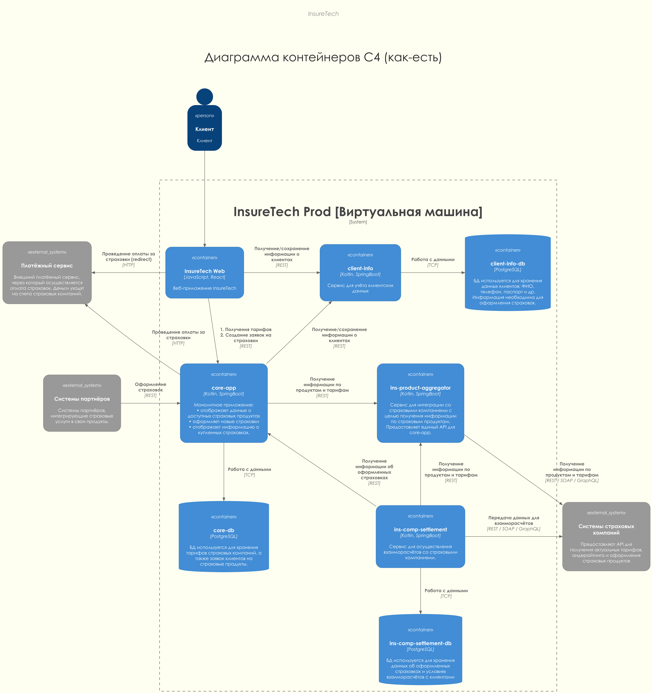
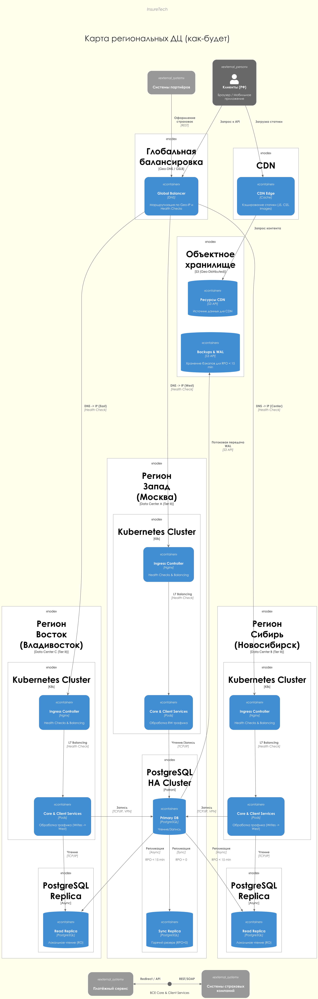

# Задание 1. Проектирование технологической архитектуры

## Подготовка

Прежде чем начать работу - конвертируем диаграммы в текстовый PlantUML формат.
Схема полностью повторяет c4 из задания.

[as-is.puml](c4/container/as-is.puml)

## Целевая архитектура (To-Be)

### 1. Стратегия масштабирования и отказоустойчивости

Рассмотрим две стратегии:

-   **Вертикальное масштабирование (Scale-Up):** Подразумевает наращивание мощности текущей ВМ. 
    -   *Преимущества:* Простота реализации, отсутствие сетевых задержек между компонентами.
    -   *Недостатки:* Наличие единой точки отказа (SPOF), жесткий "потолок" ресурсов, необходимость остановки системы для изменения ресурсов (downtime). Не позволяет достичь заданного SLA 99.9%.
-   **Горизонтальное масштабирование (Scale-Out):** Подразумевает увеличение количества узлов и экземпляров приложения.
    -   *Преимущества:* Высокая отказоустойчивость, возможность распределения по зонам доступности, гибкость при пиковых нагрузках (Auto-scaling), достижение SLA 99.9% и выше.
    -   *Недостатки:* Усложнение архитектуры (требуется Service Discovery, балансировка нагрузки), необходимость обеспечения stateless-состояния сервисов.

**Выбор:** Для InsureTech выбрана **стратегия горизонтального масштабирования**. Это единственный способ обеспечить требуемую доступность 99.9% и бесперебойную работу в разных регионах. Приложение разворачивается в нескольких независимых зонах доступности.

### 2.1. Конфигурация Kubernetes

При проектировании развёртывания в нескольких регионах рассматривались два основных подхода:

-   **Растянутый кластер (Stretched Cluster):** Единый кластер, узлы которого физически находятся в разных регионах.
    -   *Преимущества:* Единая точка управления, автоматическое распределение подов между регионами средствами Kubernetes.
    -   *Недостатки:* Критическая зависимость от сетевых задержек (latency). Для стабильной работы `etcd` требуются задержки не более 10-20 мс. При распределении между Москвой и Владивостоком задержки будут значительно выше, что приведет к деградации производительности кластера и рискам потери консистентности.
-   **Независимые кластеры (Independent Clusters):** Отдельный изолированный кластер в каждом регионе.
    -   *Преимущества:* Изоляция доменов отказа (fault isolation), минимальные сетевые задержки внутри каждого кластера, независимость от стабильности межрегиональных каналов связи.
    -   *Недостатки:* Более сложный процесс деплоя (требуется CI/CD, умеющий работать с несколькими кластерами) и необходимость внешней глобальной балансировки (GSLB).

**Выбор:** Для InsureTech выбраны **независимые кластеры** в каждой локации.
**Аргументация:** Это решение обеспечивает максимальную надежность инфраструктуры в условиях больших географических расстояний. Связность сервисов обеспечивается на прикладном уровне (через API и GSLB).

### 2.2. Балансировка нагрузки

Для распределения трафика между географически распределенными площадками рассмотрены варианты:

-   **DNS-based GSLB (Global Server Load Balancing):** Балансировка на уровне разрешения доменных имен.
    -   *Плюсы:* Легко реализуется, поддерживает маршрутизацию на основе близости (Latency-based), не является узким горлышком для трафика.
    -   *Минусы:* Зависимость от TTL DNS-записей (задержка при переключении).
-   **Anycast IP (BGP-based):** Использование одного IP-адреса, который анонсируется из разных регионов.
    -   *Плюсы:* Мгновенное переключение при падении региона, минимальные задержки.
    -   *Минусы:* Сложность настройки (требует управления на уровне сетевых протоколов/провайдера), высокая стоимость.

**Выбор:** **DNS-based GSLB**. Для требований SLA 99.9% и RTO 45 мин возможностей GSLB достаточно.

**Реализация Health Checks:**
1.  **L3/L4 Checks:** Проверка доступности IP-адресов Ingress-контроллеров на уровне балансировщика.
2.  **L7 Checks:** Запрос к специальному эндпоинту `/health` каждого кластера, который проверяет не только работу Nginx, но и связность с локальной БД.

### 2.3. Фейловер-стратегия

Для обеспечения отказоустойчивости рассмотрены стратегии:

-   **Active-Passive (Hot Standby):** Один регион основной, второй - резервный.
    -   *Плюсы:* Проще обеспечить консистентность данных.
    -   *Минусы:* Ресурсы простаивают, долгое переключение (нужно менять DNS и прогревать кэши).
-   **Active-Active (Multi-region):** Трафик распределяется между всеми регионами одновременно.
    -   *Плюсы:* Нет простоя ресурсов, мгновенная доступность при отказе одного региона (трафик просто перераспределяется GSLB), минимальный Latency для пользователей во всех регионах.
    -   *Минусы:* Сложность синхронизации данных между регионами.

**Выбор:** **Active-Active**. Это решение позволяет выполнить требование бизнеса о "независимости времени загрузки от географии". Пользователи из разных часовых поясов направляются в ближайший к ним регион.

**Соответствие RTO/RPO:**
-   **RTO (45 мин):** При отказе региона GSLB исключает его из выдачи. Время переключения зависит от TTL DNS (обычно 1-5 мин), что значительно меньше лимита.
-   **RPO (15 мин):** Асинхронная репликация между регионами настраивается с жестким мониторингом лага. В нормальном состоянии лаг составляет секунды.

### 2.4. Конфигурация базы данных

Для обеспечения высокой доступности (HA) и сохранности данных:

1.  **Инструментарий:** Использование **Patroni** для управления кластером PostgreSQL.
    -   *Почему:* Автоматизирует failover, интегрируется с Kubernetes (через etcd/Consul), признанный стандарт для HA-PostgreSQL.
2.  **Репликация:** 
    -   **Синхронная внутри региона:** Для исключения потери данных при локальном сбое узла.
    -   **Асинхронная между регионами:** Для обеспечения возможности работы в режиме Active-Active и соблюдения RPO < 15 мин без деградации производительности записи из-за сетевых задержек.
3.  **Бэкапы:** Ежечасные в объектное хранилище (S3) с гео-репликацией. Это гарантирует восстановление при катастрофическом сбое всей площадки.

### 3. Шардирование БД

Рассмотрены варианты:
-   **Горизонтальное шардирование:** Распределение данных по разным серверам по ключу (например, по ID клиента).
    -   *Плюсы:* Неограниченное масштабирование объема данных.
    -   *Минусы:* Усложнение архитектуры, сложности с JOIN-ами и целостностью.
-   **Вертикальное масштабирование и Read-реплики:** Увеличение ресурсов одного узла + использование реплик для чтения.

**Выбор: Шардирование не применяется.**
**Аргументация:** Текущий объем данных 50 GB легко обрабатывается одним современным экземпляром PostgreSQL. Преждевременная оптимизация в виде шардирования только усложнит систему без реальной пользы на данном этапе.

### 4. Доставка статического контента (CDN)

Для обеспечения одинакового времени загрузки страниц будет использована **CDN (Content Delivery Network)**. Статические файлы (картинки, JS, CSS) кэшируются на узлах, максимально приближенных к пользователю, что нивелирует влияние географического положения на скорость загрузки фронтенда.

## Финальные Диаграммы

Для визуализации технологической архитектуры подготовлены две схемы в нотации C4 Deployment:

### 1. Глобальная архитектура (Multi-region)
Эта схема демонстрирует распределение системы по трем географическим регионам и механизмы обеспечения глобальной отказоустойчивости.

**Ключевые особенности:**
*   **Глобальная балансировка (GSLB):** распределение трафика пользователей и партнёров между регионами.
*   **CDN:** доставка статического контента из ближайших к пользователю точек.
*   **Гео-репликация БД:** передача данных из центрального региона в региональные реплики.
*   **S3 Storage:** централизованное хранение бэкапов и ресурсов.

### 2. Карта регионального ДЦ
Детальная схема, описывающая внутреннюю структуру одного регионального сегмента (Сибирь или Восток или ещё какой-нибудь новый регион) и его внешние связи.

**Ключевые особенности:**
*   **Локальное чтение:** запросы на получение данных обслуживаются местной Read-репликой.
*   **Удаленная запись:** транзакции на изменение данных направляются в Primary DB (Москва).
*   **Прямые интеграции:** каждый регион самостоятельно взаимодействует с внешними API (страховые компании, оплата) для обеспечения автономности.
*   **Ingress-контроль:** единая точка входа для трафика внутри кластера Kubernetes.
