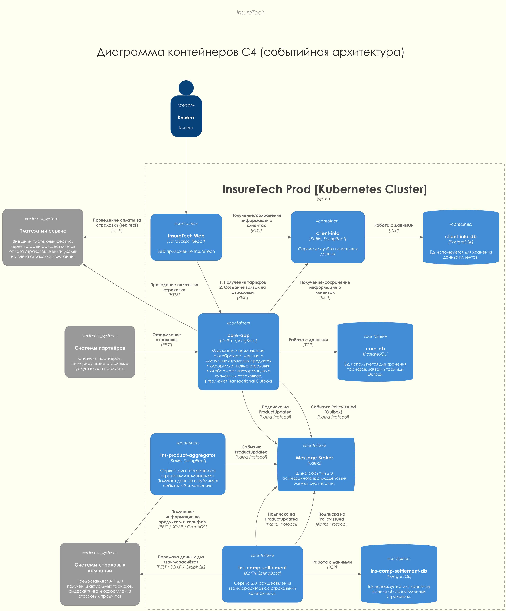

# Задание 3. Переход на Event-Driven архитектуру

## Анализ текущей архитектуры

### Проблемы

- **Синхронное взаимодействие:** Сервис `ins-product-aggregator` выполняет запросы к внешним страховым компаниям в рамках одного синхронного вызова. С ростом количества партнеров время ожидания будет только расти, что приведет к тайм-аутам и деградации производительности.
- **Опрос по расписанию (Polling):** `core-app` опрашивает агрегатор каждые 15 минут, а `ins-comp-settlement` - раз в сутки. Это создает избыточную нагрузку при отсутствии изменений и при этом допускает неактуальность данных в промежутках.
- **Пиковые нагрузки при выгрузке:** Ежесуточный запрос от `ins-comp-settlement` к `core-app` для получения всех полисов за день может вызвать всплеск потребления ресурсов (CPU/Memory) и замедлить работу обоих сервисов, в худшем случае - даже нарушить их работу.
- **Жесткая связанность:** Выход из строя агрегатора или задержки у страховых компаний напрямую влияют на работоспособность `core-app` и `ins-comp-settlement`.

### Риски

- **Каскадные сбои:** Проблемы в API одной страховой компании могут привести к "зависанию" агрегатора и, как следствие, других внутренних сервисов.
- **Нарушение SLA:** Рост задержек при агрегации данных затрудняет выполнение требований по времени отклика.
- **Потеря данных:** При сбоях во время ежесуточной синхронизации полисов есть риск расхождений в данных для взаиморасчетов.

## Решение

### Диаграмма текущего состояния

### Какие взаимодействия стоит переделать на Event-Streaming

1. **Обновление продуктов и тарифов:** Перевести с REST/Polling на публикацию событий от `ins-product-aggregator`.
   - *Почему:* Позволяет сервисам получать обновления мгновенно и только тогда, когда они происходят. Снимает нагрузку с агрегатора и делает систему более устойчивой к временной недоступности партнеров.
2. **Передача информации об оформленных страховках:** Перевести с ежесуточного REST-запроса на поток событий от `core-app`.
   - *Почему:* Позволяет `ins-comp-settlement` обрабатывать данные в реальном времени или плавно распределять нагрузку. Исключает риск падения систем при обработке огромных суточных массивов данных.

### Transactional Outbox: преимущества, недостатки и выбор решения

Для сервиса `core-app` при отправке событий об оформленных страховках можно использовать паттерн Transactional Outbox.
- **Преимущества:** Гарантирует доставку события (At-least-once delivery). Если брокер сообщений временно недоступен, событие сохранится в БД `core-app` в рамках той же транзакции, что и сама страховка, и будет отправлено позже.
- **Недостатки:** Усложнение кода и необходимость в дополнительном компоненте (Relay/CDC) для чтения таблицы Outbox.
- **Выбор:** Выбираем Transactional Outbox для `core-app`, так как оформление страховки - это финансовая операция, и потеря данных о ней недопустима. Для обновлений тарифов в `ins-product-aggregator` можно использовать упрощенную схему отправки, так как данные можно переполучить.

### Диаграмма планируемого решения

