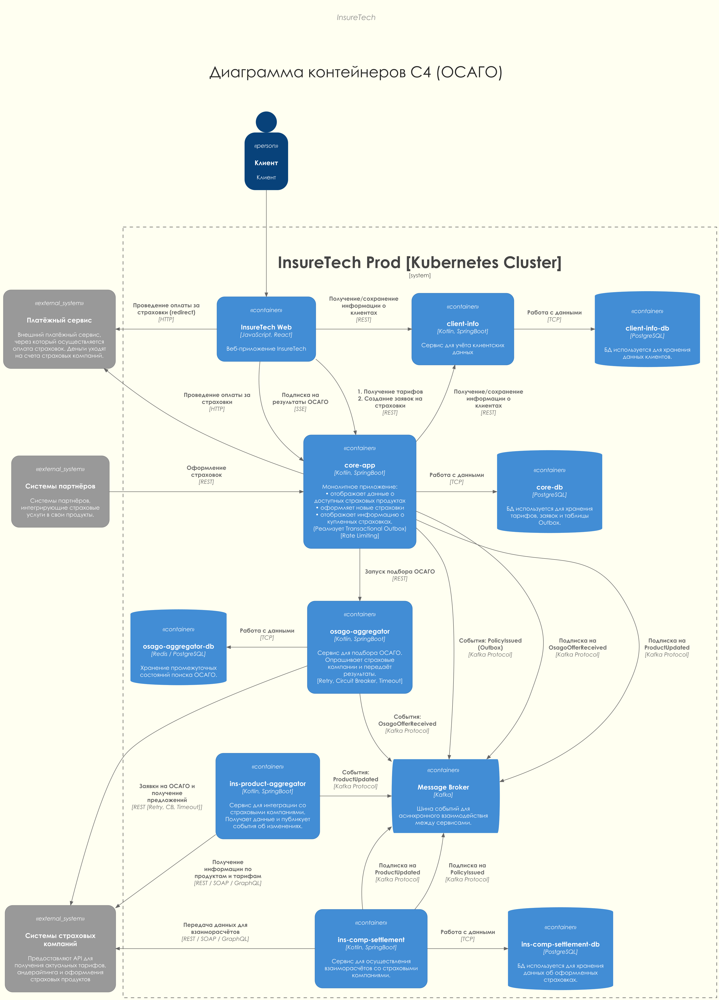

# Задание 4. Проектирование продажи ОСАГО

## Проработка osago-aggregator

### Требуется ли ему своё хранилище данных?

Да, сервису `osago-aggregator` требуется своё хранилище (например, Redis или PostgreSQL). Оно необходимо для:
- Хранения промежуточных состояний заявок (status, external_id от страховых компаний).
- Координации работы нескольких экземпляров сервиса при опросе (polling) результатов от страховых.
- Хранения кэша ответов на короткий срок для предотвращения дублирующих запросов.

### Какой API он предоставляет core-app?

Сервис предоставляет REST API для инициации процесса подбора ОСАГО:
- `POST /v1/osago/search` - принимает данные автомобиля и клиента, возвращает `search_id` и запускает асинхронный процесс опроса страховых компаний.

### Средство интеграции между сервисами core-app и osago-aggregator

Используется комбинированный подход:
1. **REST (Synchronous)** - для запуска поиска (`core-app` -> `osago-aggregator`).
2. **Message Broker (Kafka)** - для передачи результатов (`osago-aggregator` -> `core-app`). Как только приходит ответ от конкретной страховой, `osago-aggregator` публикует событие `OsagoOfferReceived` в Kafka. `core-app` подписан на эту тему и обрабатывает входящие предложения.

### API для веб-приложения в core-app

Для получения результатов в реальном времени рекомендуется использовать **Server-Sent Events (SSE)** или **WebSockets**.
- `GET /api/v1/osago/results/{search_id}` (SSE) - позволяет `core-app` "стримить" найденные предложения на фронтенд по мере их появления в Kafka.

### Средство интеграции между веб-приложением и core-app

- **SSE (Server-Sent Events)** - оптимально для односторонней передачи обновлений от сервера к клиенту.

### Требуется ли где-то применение паттернов отказоустойчивости

Да, в нескольких местах:
1. **Timeout (60s)** - на уровне `osago-aggregator` при ожидании ответа от API страховых компаний.
2. **Retry** - в `osago-aggregator` при вызовах страховых компаний (с экспоненциальной задержкой для ошибок 5xx).
3. **Circuit Breaker** - в `osago-aggregator` для каждой страховой компании, чтобы не перегружать их запросами, если они недоступны.
4. **Rate Limiting** - в `core-app` на эндпоинтах создания заявок, чтобы ограничить нагрузку в 2.5к RPS и защитить внутренние ресурсы.

## Итоговая схема с аггрегатором ОСАГО

